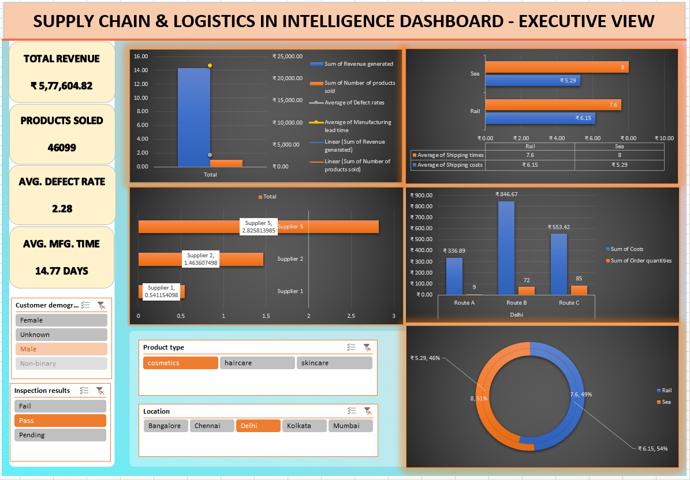

# 📦 Supply Chain Performance & Risk Analysis Dashboard

An end-to-end operational analytics dashboard developed in Microsoft Excel to evaluate supply chain efficiency, freight logistics, lead-time exposure, and vendor defect rates across 100 SKUs.



---

## 🎯 Executive Summary
Supply chain delays and unmonitored supplier defect rates directly erode operating margins and fulfillment reliability. This project evaluates operational data across three product lines (**Skincare, Haircare, Cosmetics**) and five key Indian fulfillment hubs to isolate fulfillment bottlenecks and margin performance.

### Key Performance Indicators (KPIs)
* **Total Revenue Generated:** $577,604.82
* **Total Volume Sold:** 46,099 units
* **Total Operational Cost:** $58,206.06
* **Gross Profit:** $519,398.76 (~89.9% overall margin)
* **Average Defect Rate:** 2.28%
* **Average Manufacturing Lead Time:** 14.8 days

---

## 🔍 Core Business Analysis

1. **Logistics & Carrier Performance**
   * Benchmarked three primary shipping carriers across modal options (**Road, Air, Rail, Sea**).
   * Evaluated carrier-specific transit days against shipping spend to detect cost-to-time trade-offs.

2. **Cycle Time & Operational Risk Modeling**
   * Calculated cumulative fulfillment lead times:
     $$\text{Total Cycle Days} = \text{Supplier Lead Time} + \text{Manufacturing Lead Time} + \text{Shipping Time}$$
   * Categorized products into dynamic operational risk tiers (**Low, Moderate, Higher Risk**) based on cycle duration.

3. **Supplier Quality & Defect Tracking**
   * Assessed supplier defect rates against pre-shipment inspection statuses (Pass, Fail, Pending).
   * Isolated high-risk suppliers driving defect rates above the operational baseline.

---

## 🛠️ Technical Architecture & Excel Features
* **Multi-Sheet Architecture:**
  * `supply_chain_data`: Processed tabular dataset with custom calculated fields.
  * `Pivoit_Engine`: Dedicated back-end computation engine running grouped Pivot Tables.
  * `Dashboard`: Front-facing executive view with dynamic slicers and charts.
* **Formulas & Modeling:**
  * Logical segmentation (`IFS`, `AND`, `OR`) for cycle risk classification.
  * Margin and profitability tracking (`Revenue - Total Costs`).
  * Structured aggregation via dynamic Pivot Tables and multi-criteria lookups.
* **Interactive UI:**
  * Connected visual slicers for filtering by product line, region, and risk tier.
  * Consistent color palette, structured KPI cards, and uncluttered chart formatting.

---

## 📂 Project Structure
```text
├── Supply Chain Dashboard Excel Project.xlsx   # Main Excel model with data, pivots, and dashboard
├── supply_chain_data.csv                       # Cleaned raw dataset
├── Screenshot 2026-09-18 145724.png            # Executive dashboard snapshot
└── README.md                                   # Project documentation and analysis
